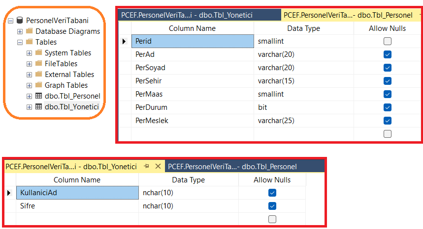
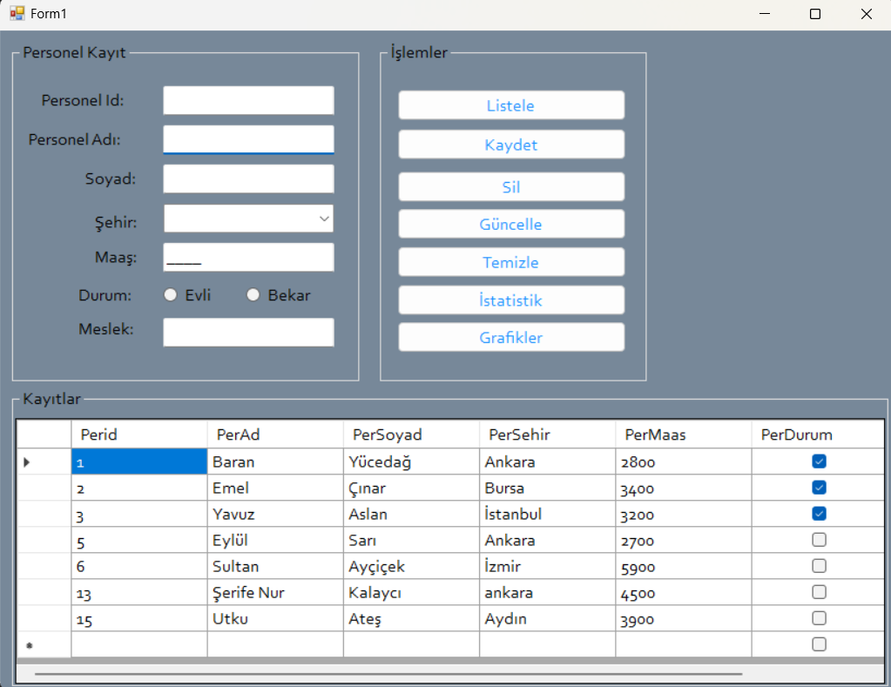
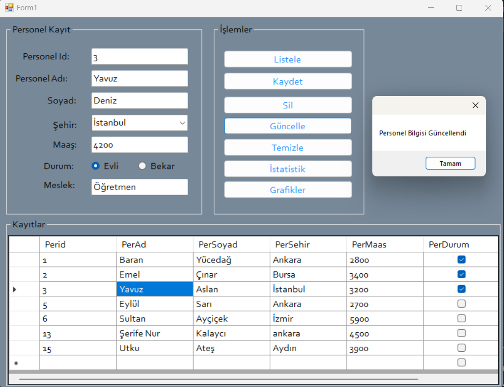
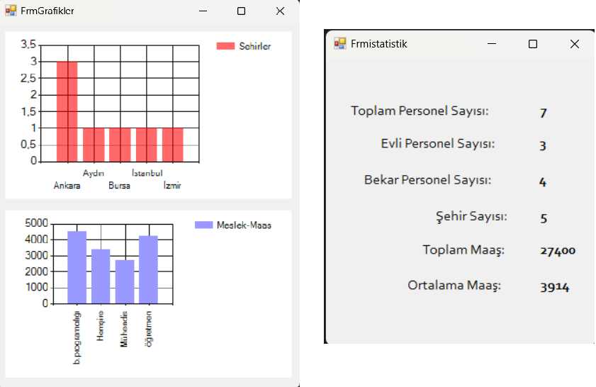

\# CSharp-PersonnelManagement

C# Windows Forms Personnel Management System with SQL Server integration and charts 📊💼

\## Features ✅

\- Add, update, delete, and list personnel records

\- Personnel statistics display (total employees, married/single count, salary stats)

\- Visual charts for city distribution and average salary per profession

\- SQL Server database integration

\- Clean and user-friendly interface

\## Technologies Used 🛠️

\- C# (Windows Forms)

\- SQL Server

\- .NET Framework 4.7.2

\## Screenshots

&nbsp; 

&nbsp;  

&nbsp; 

&nbsp; 

&nbsp; 

